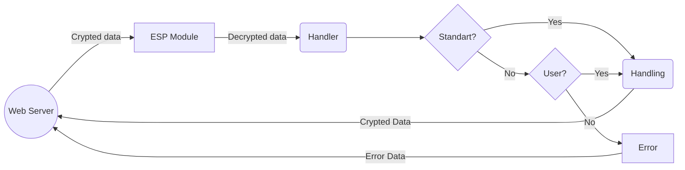
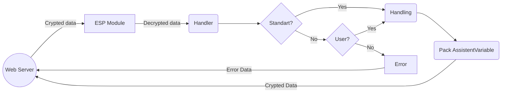

# Библиотека Assistent для ESP8266

Библиотека предназначенна для работы с [Assistent Web Server](https://github.com/MaksBerkutov/PhpAssistent), облегчает разработку IoT систем. 

Основные задчи:
 - [x] Удобство разрботки
 - [x] Шифрование всех сообщений
 - [x] Возможность создания триггеров
 - [x] Быстрое конфигуриования с помощью директив препроцессора
   

## Возможности

- **Управление WiFi:** Подключение и поддержка подключения к WiFi для ESP8266.
- **OTA обновления:** Поддержка обновлений прошивки по воздуху.
- **AES шифрование:** Обработка безопасного шифрования и дешифрования сообщений.
- **Обработка команд:** Обработка входящих команд и выполнение соответствующих действий.

## Требования

- **ESP8266**: Для использования этой библиотеки необходимо устройство ESP8266.
- **Arduino IDE**: Убедитесь, что у вас настроена Arduino IDE для разработки под ESP8266.
- **Библиотеки**:
  - [**`ArduinoJson`**](https://github.com/bblanchon/ArduinoJson)
  - [**`AESLib`**](https://github.com/DavyLandman/AESLib)
  - [**`base64_encode`**](https://github.com/Densaugeo/base64_arduino)


## Установка
Для PlatformIO просто клонируйте репозиторий и пишете скетч в `main.cpp`.

Для ArduinoIDE скопируйте файлы из `/lib` в  папку `~/Arduino/libraries`  и подключите его в вашем скетче следующим образом:

```cpp
#include <Assistent.h>
```

## Конфигурация

В начале вашего скетча вы можете включать или отключать функции с помощью следующих директив препроцессора:

```cpp
#define ASSISTENT_DEBUG   // Включить сообщения отладки
#define ASSISTENT_OTA     // Включить OTA обновления
```

## Пример использования

```cpp
#include <Assistent.h>

AssistenWiFi assistant;

void setup() {
  // Инициализация ассистента
  assistant.Begin(
    "your_AES_key",            // AES ключ
    "YourDeviceName",          // Имя устройства
    CMD,                       // Список команд
    HandlerCMDS,               // Обработчики команд
    CMD_SIZE,                  // Размер списка команд
    CMD_REC,                   // Список команд ответа
    HandlerCMDSRec,            // Обработчики команд ответа
    CMD_REC_SIZE,              // Размер списка ответа
    "your_wifi_ssid",          // SSID WiFi
    "your_wifi_password",      // Пароль WiFi
    9600,                      // Скорость передачи (бод). Стандартное занчение 9600
    NULL                       // Кастомный обработчик сообщений. Стандартное занчение NULL
  );
}

void loop() {
  // Поддерживаем работу ассистента
  assistant.Handle();
}
```
## Отправка на Web Server сигнала

```cpp
#include <Assistent.h>

AssistenWiFi assistant;

void setup() {
  //initialize
}

void loop() {

  assistant.Handle();

  if(/*Ваш тригегер например нажатие кнопки*/)
    assistent.IoTMessage(AssistentVariable(new String[1] { "KEY"},new String[1] {"VALUE"},1));
    //Можно отправлять несколько пар ключ-значений. Логику обработки настривавть на Web сервере в вкладке сценарии.
    //Где нужно будет указать установленную ключ пару.

}
```
## Команды
### Без ответа
Команды без ответа заставляют модуль сделать что-то к примеру:
- включить/выключить реле, светодиод.
- отправить сообщение на сервер/плату
- и тд. и тп. 
  
Пример создания
  ```cpp
void ON() //Обработчки коммады ON
{
  State = true;
  digitalWrite(PinLed, LOW);
}
void OFF()  //Обработчки коммады OFF
{
  State = false;
  digitalWrite(PinLed, HIGH);
}


HandlerCMD HCmd[]{  //Массив обработчиков который пердаём в begin
    ON,
    OFF
};

String CMD[]{ //Массив названий который пердаём в begin
    "ON", //Название комманды для обработчика ON
    "OFF" //Название комманды для обработчика OFF
}; 
  ```
При создании нужно руководстваться парой правил.

- Обрабочик обязательно должен быть типа void без парметров **`void name()`**
- Названия как функций так и команд могут быть произвольные главное что бы **индексы совпадали**
  - К 0 индексу в массиве названий команд всегда будет вызван 0 индекс из массива обработчик комманд.
- Длина массивов должна быть одинаковая, сколько комманд столько и названий.

Когда данные приходят с сервера, модуль их дешифрует, извлекая команду.

1) Сначала модуль проверяет команду на совпадение с зарезервированными командами, которые определены в прошивке.
2) Если совпадение не найдено, модуль проверяет команду на соответствие с вашим пользовательским массивом команд.
3) Если команда найдена в пользовательском массиве, вызывается соответствующий обработчик для выполнения действия.
4) Если команда не найдена ни в зарезервированных, ни в пользовательских командах, модуль отправляет ошибку в ответ на запрос с сообщением о неверной команде.
---
#### График:


### Команды с ответом
Основная разница в сравнении с коммандами без ответов в том что сервер понимает что должен получить результат. Это нужно для:
- Опроса датчиков
- Получения состояние реле
- Получения значений в EEPROM
- и тд. и тп. 

Резльтат представлен в виде `Ключ=>Значения`. Для упрощению разработчки везде используеться клас **AssistentVariable** который берёт на себя задчу корректной упаковки занчений. Со стоорноый разрабочткика резульатом функции нужно вернуть экземпляр данного класса. 

Пример:
  ```cpp
AssistentVariable GetStateLed()
{
  return AssistentVariable(new String[1]{"State"}, new String[1]{State?"true":"false"}, 1);
}
HandlerCMDRec HCmdRec[]{  //Массив обработчиков который пердаём в begin
    GetStateLed
};
String CMDRec[] = { //Массив названий который пердаём в begin
    "GetStateLed" // Название комманды для обработчика GetState 
};
  ```
  Логика та же только мы отправляем не просто что поняли команду, или команда не найдена. А запакованный массив ключ значений.


## Лицензия
Этот проект лицензируется на условиях MIT License. 

## Контакты

**Maks Berkutov**

- [Telegram](https://t.me/i37Holodok73i)
- [GitHub](https://github.com/MaksBerkutov)
- [Email](mailto:0701200maks@gmail.com)


